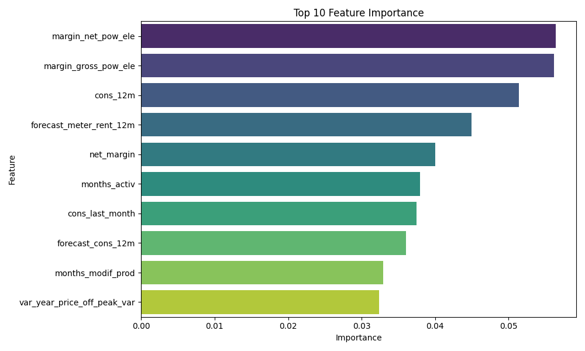

# Churn Prediction Web App - Visual Mockup

This document provides a visual representation of how the Streamlit web app would look when running.

## Main Interface

The app has a clean, user-friendly interface with a navigation sidebar and two main tabs:

```
+------------------------------------------------------+
|                                                      |
|  📊 Customer Churn Prediction                        |
|                                                      |
|  This app predicts whether a customer will churn     |
|  based on various features.                          |
|                                                      |
|  [Make Prediction] [Model Information]               |
|                                                      |
+------------------------------------------------------+
```

## Make Prediction Tab

The prediction tab organizes features into logical categories with a clean form layout:

```
+------------------------------------------------------+
|                                                      |
|  Enter Customer Information                          |
|                                                      |
|  Consumption Information                             |
|  +----------------+ +----------------+ +------------+|
|  | cons_12m       | | cons_gas_12m   | | cons_last_m||
|  | [    0.0     ] | | [    0.0     ] | | [   0.0   ]||
|  +----------------+ +----------------+ +------------+|
|                                                      |
|  Forecast Information                                |
|  +----------------+ +----------------+ +------------+|
|  | forecast_cons  | | forecast_disc  | | forecast_m ||
|  | [    0.0     ] | | [    0.0     ] | | [   0.0   ]||
|  +----------------+ +----------------+ +------------+|
|                                                      |
|  ... (more feature categories) ...                   |
|                                                      |
|  [Predict Churn]                                     |
|                                                      |
+------------------------------------------------------+
```

## Prediction Results

After submitting the form, the app displays the prediction results with visualizations:

```
+------------------------------------------------------+
|                                                      |
|  Prediction Result                                   |
|                                                      |
|  ✅ Customer is likely to stay  | Churn Probability: |
|                                | 16.48%             |
|                                                      |
|  +----------------------------------------------+    |
|  |                                              |    |
|  | [Low Risk ===============|======== High Risk]|    |
|  |                          16.48%              |    |
|  +----------------------------------------------+    |
|                                                      |
|  Recommendation                                      |
|                                                      |
|  This customer has a low risk of churning. Consider: |
|  - Continuing to monitor their satisfaction          |
|  - Offering cross-sell or upsell opportunities       |
|  - Encouraging referrals                             |
|  - Gathering feedback for service improvements       |
|                                                      |
+------------------------------------------------------+
```

## Model Information Tab

The Model Information tab provides details about the model and visualizes feature importance:

```
+------------------------------------------------------+
|                                                      |
|  Model Information                                   |
|                                                      |
|  This prediction is powered by a Random Forest       |
|  classifier trained on historical customer data.     |
|                                                      |
|  Model Parameters                                    |
|  - Number of trees: 100                              |
|  - Maximum depth: 15                                 |
|  - Minimum samples split: 10                         |
|  - Minimum samples leaf: 4                           |
|  - Class weight: Balanced                            |
|                                                      |
|  Top 10 Feature Importance                           |
|                                                      |
|  +----------------------------------------------+    |
|  |                                              |    |
|  | margin_net_pow_ele     ■■■■■■■■■■■■■■■■■■■   |    |
|  | margin_gross_pow_ele   ■■■■■■■■■■■■■■■■■■■   |    |
|  | cons_12m               ■■■■■■■■■■■■■■■       |    |
|  | forecast_meter_rent_12m ■■■■■■■■■■■■■        |    |
|  | net_margin             ■■■■■■■■■■■           |    |
|  | ...                                          |    |
|  +----------------------------------------------+    |
|                                                      |
|  Feature Importance Explanation:                     |
|                                                      |
|  The chart above shows the top 10 most influential   |
|  features in predicting customer churn. Features     |
|  with higher importance have a greater impact on     |
|  the model's predictions.                            |
|                                                      |
|  Understanding these key factors can help businesses |
|  focus their retention efforts on the most critical  |
|  aspects of the customer relationship.               |
|                                                      |
+------------------------------------------------------+
```

## Feature Importance Visualization

Here's the actual feature importance visualization generated by our model:



## Benefits of the Web Interface

1. **User-Friendly**: The interface is intuitive and organized, making it easy for non-technical users to make predictions.

2. **Informative**: The app provides not just predictions but also explanations and recommendations.

3. **Visual**: Charts and visualizations help users understand the model's output and the factors driving churn.

4. **Interactive**: Users can input different customer scenarios to see how various factors affect churn probability.

5. **Educational**: The Model Information tab helps users understand how the model works and what factors are most important.

## How to Run the App

To run this app on your local machine:

1. Install the required dependencies:
   ```
   pip install -r requirements.txt
   ```

2. Train and save the model:
   ```
   python train_model.py
   ```

3. Run the Streamlit app:
   ```
   streamlit run app.py
   ```

4. Open your browser and navigate to the URL shown in the terminal (typically http://localhost:8501)
